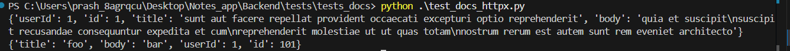

---

title: HTTPX Syntax 
displayed-sidebar: backend
sidebar_position: 3
---


## **1. Making HTTP Requests**

For simple, isolated requests, HTTPX allows you to use **top-level functions** like `httpx.get()`, `httpx.post()`, and others. This approach is ideal for quick, one-off requests when performance optimizations like connection reuse are not necessary.

### **Synchronous Requests**

In the synchronous mode, HTTPX blocks the program’s execution until the request is completed. Use this approach when you need straightforward, blocking HTTP requests.

#### **Example:**

```python
import httpx

# Sending a GET Request
response = httpx.get("https://jsonplaceholder.typicode.com/posts/1")
assert response.status_code == 200
print(response.json())

# Sending a POST Request
response = httpx.post(
    "https://jsonplaceholder.typicode.com/posts",
    json={"title": "foo", "body": "bar", "userId": 1}
)
assert response.status_code == 201
print(response.json())
```
#### **output**



### **Asynchronous Requests**

In the asynchronous mode, HTTPX allows non-blocking requests by using `await`, which makes it ideal for handling I/O-bound tasks like web scraping or interacting with APIs in parallel.

#### **Example:**

```python
import asyncio
import httpx

async def fetch_data():
    # GET Request
    response = await httpx.get("https://jsonplaceholder.typicode.com/posts/1")
    assert response.status_code == 200
    print(response.json())

    # POST Request
    response = await httpx.post(
        "https://jsonplaceholder.typicode.com/posts",
        json={"title": "foo", "body": "bar", "userId": 1}
    )
    assert response.status_code == 201
    print(response.json())

# Run the async function
asyncio.run(fetch_data())
```

**Key Notes**:
- `httpx.get()` and `httpx.post()` are used for sending HTTP requests.
- **Synchronous requests** block the execution until a response is received.
- **Asynchronous requests** allow concurrent requests without blocking the program.

---

## **2. Making HTTP Requests With a Client**

### **Understanding HTTPX Clients for Request Handling**

In scenarios where you need to perform multiple requests, manage persistent connections, or configure shared settings, using an `httpx.Client` or `httpx.AsyncClient` is highly recommended. Clients are designed for efficiency and flexibility, making them an essential tool for applications requiring frequent communication with the same server.

#### **Why Use an HTTPX Client?**

When you use the basic HTTPX functions (like `httpx.get()` or `httpx.post()`), a new connection is established for each request. This process quickly becomes inefficient when multiple requests are made to the same host, leading to unnecessary resource usage.

A Client instance, however, uses connection pooling, meaning that it reuses the same TCP connection for multiple requests to the same server. 

By adopting `httpx.Client` or `httpx.AsyncClient`, you can build faster, more efficient, and more scalable applications. This makes them indispensable for scenarios that demand optimized communication with remote services. 
 
### **Synchronous Client**

The `httpx.Client` class is used for synchronous requests. It manages connection pooling and other settings like headers and cookies.

#### **Example:**

```python
import httpx

# Using a synchronous client
with httpx.Client() as client:
    # Sending a GET Request
    response = client.get("https://jsonplaceholder.typicode.com/posts/1")
    assert response.status_code == 200
    print(response.json())

    # Sending a POST Request
    response = client.post(
        "https://jsonplaceholder.typicode.com/posts",
        json={"title": "foo", "body": "bar", "userId": 1}
    )
    assert response.status_code == 201
    print(response.json())
```

### **Asynchronous Client**

The `httpx.AsyncClient` class is designed for asynchronous HTTP requests, allowing non-blocking operations. It’s particularly useful in high-performance, I/O-bound applications.

#### **Example:**

```python
import asyncio
import httpx

# Using an asynchronous client
async def fetch_data():
    async with httpx.AsyncClient() as client:
        # Sending a GET Request
        response = await client.get("https://jsonplaceholder.typicode.com/posts/1")
        assert response.status_code == 200
        print(response.json())

        # Sending a POST Request
        response = await client.post(
            "https://jsonplaceholder.typicode.com/posts",
            json={"title": "foo", "body": "bar", "userId": 1}
        )
        assert response.status_code == 201
        print(response.json())

# Run the async function
asyncio.run(fetch_data())
```

**Key Notes**:
- **Client management** allows for connection reuse, reducing overhead.
- **Persistent Connections** help improve performance for multiple requests to the same server.
- **Shared Configuration**: Clients allow the sharing of settings like headers, cookies, and authentication across multiple requests.

---

## **3. Key Differences: Top-Level Functions vs. Client Instances**

Here’s a quick comparison of the two approaches:

| Feature                    | Without a Client                          | With a Client                                |
|----------------------------|-------------------------------------------|----------------------------------------------|
| **Connection Management**  | Automatically managed per request         | Persistent connection pool for efficiency    |
| **Shared Configuration**   | Limited (independent per request)         | Shared headers, cookies, auth, etc.          |
| **Use Case**               | Simple, one-off requests                  | Multiple requests with shared configurations |
| **Performance**            | Suitable for fewer requests               | Faster for bulk requests due to connection reuse |

---

## **4. Common Use Cases for Using a Client**

Using `httpx.Client` or `httpx.AsyncClient` becomes especially beneficial in the following situations:

### **a. Managing Shared Configurations**

When you need consistent headers, cookies, or authentication settings across multiple requests.

#### **Example:**

```python
import httpx

# Setting headers globally
headers = {"Authorization": "Bearer YOUR_TOKEN"}
with httpx.Client(headers=headers) as client:
    response = client.get("https://api.example.com/user")
    assert response.status_code == 200
    print(response.json())
```

### **b. Reusing Connections for Performance**

If you are making several requests to the same server, reusing the connection pool improves speed and reduces resource consumption.

#### **Example:**

```python
import httpx

with httpx.Client() as client:
    for i in range(5):
        response = client.get(f"https://jsonplaceholder.typicode.com/posts/{i + 1}")
        print(response.json())
```

### **c. Handling Authentication**

For authenticated API requests, using a client with built-in support for authentication schemes (like Basic Auth or OAuth2) simplifies repeated authentication handling.

#### **Example:**

```python
import httpx

# Using Basic Authentication
auth = ("username", "password")
with httpx.Client(auth=auth) as client:
    response = client.get("https://api.example.com/protected-resource")
    assert response.status_code == 200
    print(response.json())
```

### **d. Streaming Large Files**

For efficient downloading or uploading of large files, using a client to stream data can help manage memory usage and reduce overhead.

#### **Example:**

```python
import httpx

# Downloading a large file in chunks
with httpx.Client() as client:
    with client.stream("GET", "https://example.com/large-file") as response:
        with open("large-file", "wb") as file:
            for chunk in response.iter_bytes():
                file.write(chunk)
```

### **e. Testing APIs with Consistent Configurations**

When interacting with an API that requires multiple requests, using a client simplifies management of base URLs, headers, and other configurations.

#### **Example:**

```python
import httpx

with httpx.Client(base_url="https://api.example.com") as client:
    # First Request
    response = client.get("/user")
    assert response.status_code == 200
    print(response.json())

    # Second Request
    response = client.post("/data", json={"key": "value"})
    assert response.status_code == 201
    print(response.json())
```

---

