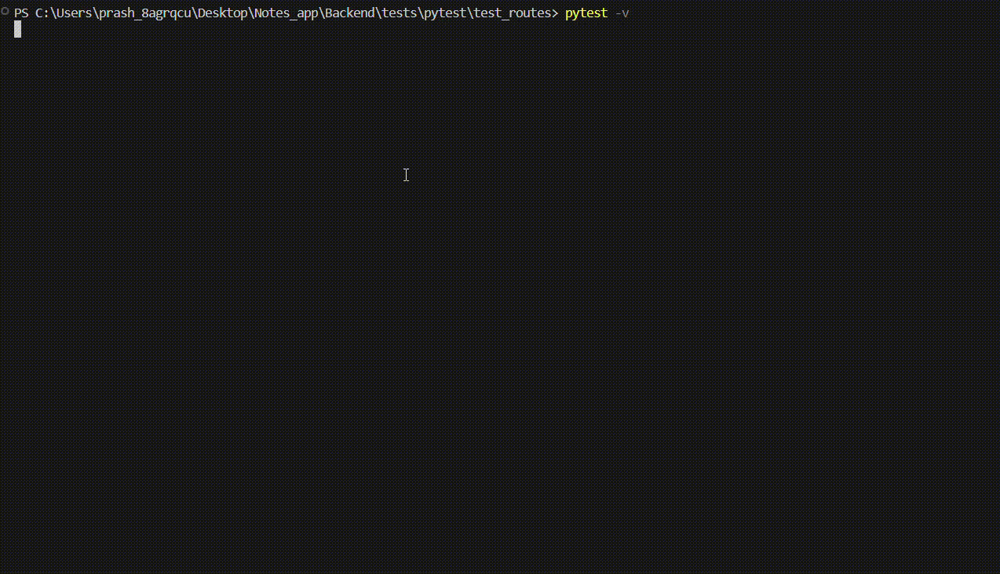

### **Code Overview: Testing an API with `pytest` and `FastAPI`**

This Python script demonstrates how to write integration tests for a RESTful API using the `pytest` framework and `FastAPI`. It provides a comprehensive example of testing user registration, authentication (login), token refreshing, and CRUD operations on notes.

---
### **Purpose**
The purpose of these tests is to validate the functionality of the **Notes App API** by simulating HTTP requests using the `pytest` library and verifying the responses. These tests cover:
- Registering a new user.
- Logging in and generating access/refresh tokens.
- Refreshing an access token.
- Creating a new note.
- Fetching all notes for a user.
- Fetching a Specific Note.
- Updating a note.
- Deleting a note.

Each test ensures that the API adheres to expected behavior, including proper status codes, response data, and database interactions.

---

### **Key Components**

#### 1. **conftest**
configuration file for running pytest.

```python
import pytest
import pytest_asyncio
from sqlalchemy.ext.asyncio import AsyncSession, create_async_engine, async_sessionmaker
from sqlalchemy.orm import sessionmaker
from fastapi.testclient import TestClient
from dao.note_dao import NoteDAO
from dao.user_dao import UserDAO
from models.model import Base, User 
from main import app  
from db.database import get_db  


TEST_DATABASE_URL = "sqlite+aiosqlite:///:memory:"

@pytest_asyncio.fixture(scope="function")
async def override_get_db():
    """Fixture to provide a fresh test database session per test."""
    engine = create_async_engine(TEST_DATABASE_URL, echo=True)
    TestingSessionLocal = async_sessionmaker(
        bind=engine, class_=AsyncSession, expire_on_commit=False
    )

    async with engine.begin() as conn:
        await conn.run_sync(Base.metadata.create_all)

    async with TestingSessionLocal() as session:
        yield session

    async with engine.begin() as conn:
        await conn.run_sync(Base.metadata.drop_all)


@pytest.fixture
def setup_db(override_get_db):
    """Fixture to override the get_db dependency for FastAPI."""
    app.dependency_overrides[get_db] = lambda: override_get_db
    with TestClient(app) as client:
        yield client  


@pytest_asyncio.fixture
async def user_dao(override_get_db):
    """Fixture to provide a UserDAO instance with a test database session."""
    return UserDAO(db=override_get_db)

@pytest_asyncio.fixture
async def note_dao(override_get_db):
    """Fixture to provide a NoteDAO instance with a test database session."""
    return NoteDAO(db=override_get_db)
```

---
#### 2. **Imports**
```python
import pytest
from fastapi.testclient import TestClient
from schemas.user import UserCreateDTO, RefreshTokenDTO
from schemas.note import NoteCreateDTO
from main import app  
```

- **`pytest`**: A powerful testing framework for Python.
- **`TestClient` from FastAPI**: Simulates HTTP requests to the API without requiring a running server.
- **`UserCreateDTO`, `RefreshTokenDTO`, `NoteCreateDTO`**: Pydantic models used for validating request payloads.
- **`app`**: The FastAPI application instance.

---
### **Test Functions**

#### **1. Registering a User**
```python
@pytest.mark.asyncio
async def test_register_user(setup_db: TestClient, user_dao):
    """Test registering a new user."""
    user_data = UserCreateDTO(username="testuser", password="testpassword", full_name="Test User")
    response = setup_db.post("/register/", json=user_data.dict())
    assert response.status_code == 200
    assert response.json() == {"message": "User created successfully"}
    user = await user_dao.get_user_by_username("testuser")
    assert user is not None
    assert user.username == "testuser"
    assert user.full_name == "Test User"
```

- **Purpose**: Validates the registration of a new user via a `POST` request.
- **Key Steps**:
  - Send a `POST` request to `/register/` with valid user data (username, password, and full name).
  - Verify that the response status code is `200 OK` and the response message confirms successful user creation (`{"message": "User created successfully"}`).
  - Query the database using the `user_dao` fixture to retrieve the newly registered user by their username.
  - Validate that the user exists in the database and that their details (username and full name) match the input data.

---

#### **2. Login and Token Generation**
```python
@pytest.mark.asyncio
async def test_login_and_get_tokens(setup_db: TestClient, authenticated_user):
    """Test logging in and retrieving access and refresh tokens."""
    response = setup_db.post(
        "/token/",
        data={"username": authenticated_user["user"]["username"], "password": "testpassword"}
    )
    assert response.status_code == 200
    tokens = response.json()
    assert "access_token" in tokens
    assert "refresh_token" in tokens
    assert tokens["token_type"] == "bearer"
```

- **Purpose**: Validates the login process and retrieval of access and refresh tokens.
- **Key Steps**:
  - Send a `POST` request to `/token/` with valid credentials.
  - Verify that the response contains both `access_token` and `refresh_token`, and that the token type is `bearer`.

---

#### **3. Token Refresh**
```python
@pytest.mark.asyncio
async def test_refresh_access_token(setup_db: TestClient, authenticated_user):
    """Test refreshing the access token using a refresh token."""
    tokens = await test_login_and_get_tokens(setup_db, authenticated_user)
    response = setup_db.post(
        "/refresh/",
        json=RefreshTokenDTO(refresh_token=tokens["refresh_token"]).dict()
    )
    assert response.status_code == 200
    new_tokens = response.json()
    assert "access_token" in new_tokens
    assert new_tokens["token_type"] == "bearer"
```

- **Purpose**: Validates the ability to refresh an access token using a refresh token.
- **Key Steps**:
  - Use the `refresh_token` obtained during login to send a `POST` request to `/refresh/`.
  - Verify that the response contains a new `access_token` and that the token type is `bearer`.

---

#### **4. Creating a Note**
```python
@pytest.mark.asyncio
async def test_create_note(setup_db: TestClient, authenticated_user, note_dao):
    """Test creating a new note."""
    note_data = NoteCreateDTO(title="Test Note", body="This is a test note.")
    response = setup_db.post(
        "/note/",
        json=note_data.dict(),
        headers={"Authorization": f"Bearer {authenticated_user['access_token']}"}
    )
    assert response.status_code == 200
    response_data = response.json()
    assert response_data["title"] == note_data.title
    assert response_data["body"] == note_data.body
    assert response_data["user_id"] == authenticated_user["user"].id
    note = await note_dao.get_note_by_id(response_data["note_id"])
    assert note is not None
    assert note.title == note_data.title
    assert note.body == note_data.body
```

- **Purpose**: Validates the creation of a new note via a `POST` request.
- **Key Steps**:
  - Send a `POST` request with valid data and authentication headers.
  - Verify the response status code and payload.
  - Check the database to ensure the note was created.

---

#### **5. Fetching All Notes**
```python
@pytest.mark.asyncio
async def test_get_notes(setup_db: TestClient, authenticated_user, note_dao):
    """Test fetching all notes for the current user."""
    note1 = await note_dao.create_note(title="Note 1", body="Body 1", user_id=authenticated_user["user"].id)
    note2 = await note_dao.create_note(title="Note 2", body="Body 2", user_id=authenticated_user["user"].id)
    response = setup_db.get(
        "/note/all",
        headers={"Authorization": f"Bearer {authenticated_user['access_token']}"}
    )
    assert response.status_code == 200
    response_data = response.json()
    assert len(response_data) == 2
    assert response_data[0]["title"] == "Note 1"
    assert response_data[1]["title"] == "Note 2"
```

- **Purpose**: Validates fetching all notes for an authenticated user via a `GET` request.
- **Key Steps**:
  - Create two notes in the database.
  - Send a `GET` request to fetch all notes.
  - Verify the response contains the correct number of notes and their details.

---

#### **6. Fetching a Specific Note**
```python
@pytest.mark.asyncio
async def test_get_note_by_id(setup_db: TestClient, authenticated_user, note_dao):
    """Test fetching a note by its ID."""
    note = await note_dao.create_note(title="Test Note", body="This is a test note.", user_id=authenticated_user["user"].id)
    response = setup_db.get(
        f"/note/{note.note_id}",
        headers={"Authorization": f"Bearer {authenticated_user['access_token']}"}
    )
    assert response.status_code == 200
    response_data = response.json()
    assert response_data["title"] == "Test Note"
    assert response_data["body"] == "This is a test note."
```

- **Purpose**: Validates fetching a specific note by its ID via a `GET` request.
- **Key Steps**:
  - Create a note in the database.
  - Send a `GET` request with the note's ID.
  - Verify the response contains the correct note details.

---

#### **7. Updating a Note**
```python
@pytest.mark.asyncio
async def test_update_note(setup_db: TestClient, authenticated_user, note_dao):
    """Test updating a note."""
    note = await note_dao.create_note(title="Test Note", body="This is a test note.", user_id=authenticated_user["user"].id)
    updated_note_data = NoteCreateDTO(title="Updated Title", body="Updated Body")
    response = setup_db.put(
        f"/note/{note.note_id}",
        json=updated_note_data.dict(),
        headers={"Authorization": f"Bearer {authenticated_user['access_token']}"}
    )
    assert response.status_code == 200
    response_data = response.json()
    assert response_data["title"] == updated_note_data.title
    assert response_data["body"] == updated_note_data.body
```

- **Purpose**: Validates updating an existing note via a `PUT` request.
- **Key Steps**:
  - Create a note in the database.
  - Send a `PUT` request with updated data.
  - Verify the response reflects the updated details.

---

#### **8. Deleting a Note**
```python
@pytest.mark.asyncio
async def test_delete_note(setup_db: TestClient, authenticated_user, note_dao):
    """Test deleting a note."""
    note = await note_dao.create_note(title="Test Note", body="This is a test note.", user_id=authenticated_user["user"].id)
    response = setup_db.delete(
        f"/note/{note.note_id}",
        headers={"Authorization": f"Bearer {authenticated_user['access_token']}"}
    )
    assert response.status_code == 204
    deleted_note = await note_dao.get_note_by_id(note.note_id)
    assert deleted_note is None
```

- **Purpose**: Validates deleting a note via a `DELETE` request.
- **Key Steps**:
  - Create a note in the database.
  - Send a `DELETE` request with the note's ID.
  - Verify the response status code and that the note no longer exists in the database.

---

### **Entry Point**
To run the tests, use the following command:

```bash
pytest -v

```
### **Output**

