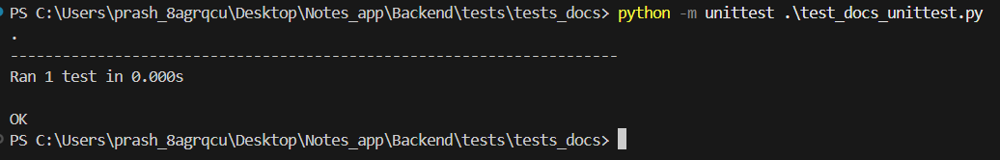

## 1. **Basic Test Syntax**

To define a test function, create a class that inherits from `unittest.TestCase`. Each test method must start with the prefix `test_`.

#### Example:
```python
import unittest

class TestMathOperations(unittest.TestCase):
    def test_addition(self):
        self.assertEqual(1 + 1, 2)
```

#### **output**:


---

### 2. **Using Fixtures for Setup and Teardown**

Fixtures in `unittest` are implemented using the `setUp()` and `tearDown()` methods. These methods run before and after each test, respectively.

#### Basic Example:
```python
import unittest

class TestDatabaseOperations(unittest.TestCase):
    def setUp(self):
        self.database = {"user": "admin", "password": "12345"}

    def tearDown(self):
        self.database.clear()

    def test_database_user(self):
        self.assertEqual(self.database["user"], "admin")
```

- **`setUp()`**: Runs before each test method.
- **`tearDown()`**: Runs after each test method.
- **Shared Resources**: Use these methods to initialize or clean up resources.

---

### 3. **Assertions**

Assertions are crucial for verifying that the code behaves as expected. `unittest` provides a variety of assertion methods.

#### Common Assertions:
```python
def test_example(self):
    self.assertEqual(1, 1)                 # Equality assertion
    self.assertNotEqual(1, 2)             # Inequality assertion
    self.assertTrue(True)                 # Boolean assertion
    self.assertFalse(False)               # Boolean assertion
    self.assertIn("apple", ["apple", "banana"])  # Containment assertion
    self.assertIsInstance(123, int)       # Type assertion
```


### 4. **Running Tests**

To execute tests, use the following command:

```bash
python -m unittest
```

You can also specify a file or directory:

```bash
python -m unittest test_example.py  # Run tests in a specific file
python -m unittest discover tests/  # Run tests in a directory
```

#### Command-Line Options:
- `-v`: Verbose output.
- `-k <expression>`: Run tests matching a specific pattern.
- `--failfast`: Stop after the first failure.

---

### 5. **Parameterized Testing**

`unittest` does not have built-in parameterization like `pytest`, but you can achieve similar functionality using loops or helper functions.

#### Example:
```python
import unittest

class TestAddition(unittest.TestCase):
    def test_addition(self):
        test_cases = [
            (1, 1, 2),
            (2, 2, 4),
            (3, 3, 6)
        ]
        for input1, input2, expected in test_cases:
            with self.subTest(input1=input1, input2=input2, expected=expected):
                self.assertEqual(input1 + input2, expected)
```

- **`subTest()`**: Allows multiple assertions within a single test method without stopping on failure.

---


### 6. **Organizing and Discovering Tests**

`unittest` automatically discovers tests in files named `test_*.py` or `*_test.py`. You can organize tests into directories.

#### Test Structure Example:
```
tests/
    test_basic.py
    test_advanced.py
    subdir/
        test_submodule.py
```
---

### 7. **Skipping Tests and Expected Failures**

You can skip tests or mark them as expected failures using decorators.

#### Skipping a Test:
```python
import unittest

class TestExample(unittest.TestCase):
    @unittest.skip("This test is not yet implemented.")
    def test_not_implemented(self):
        self.fail("This should not run.")
```

#### Expected Failure:
```python
import unittest

class TestExample(unittest.TestCase):
    @unittest.expectedFailure
    def test_expected_failure(self):
        self.assertEqual(1, 2)  # This will be marked as an expected failure
```

---

### 8. **Testing Class-Based OOP Structures**

`unittest` supports testing classes and their methods effectively.

#### 8.1 Testing Classes and Methods
You can test classes and their methods by creating instances within your tests and verifying their behavior.

##### Example:
```python
# person.py
class Person:
    def __init__(self, name, age):
        self.name = name
        self.age = age

    def greet(self):
        return f"Hello, my name is {self.name} and I am {self.age} years old."

    def is_adult(self):
        return self.age >= 18

# test_person.py
import unittest
from person import Person

class TestPerson(unittest.TestCase):
    def test_person_greet(self):
        person = Person("Alice", 30)
        self.assertEqual(person.greet(), "Hello, my name is Alice and I am 30 years old.")

    def test_person_is_adult(self):
        adult = Person("Bob", 25)
        child = Person("Charlie", 10)
        self.assertTrue(adult.is_adult())
        self.assertFalse(child.is_adult())
```


#### 8.2 Mocking Dependencies in Classes
Mock external dependencies, such as database connections or APIs, when testing class behavior.

##### Example:
```python
from unittest.mock import MagicMock
from payment_gateway import Order, PaymentGateway

class TestOrder(unittest.TestCase):
    def test_order_checkout(self):
        mock_gateway = MagicMock()
        mock_gateway.process_payment.return_value = {"status": "success", "amount": 100}
        order = Order(mock_gateway)
        self.assertTrue(order.checkout(100))
        mock_gateway.process_payment.assert_called_once_with(100)
```

#### 8.3 Testing Exceptions in Classes
Verify that classes handle exceptions properly using `assertRaises`.

##### Example:
```python
import unittest
from bank_account import BankAccount

class TestBankAccount(unittest.TestCase):
    def test_negative_balance_raises_exception(self):
        with self.assertRaises(ValueError, msg="Balance cannot be negative."):
            BankAccount(-100)
```

---