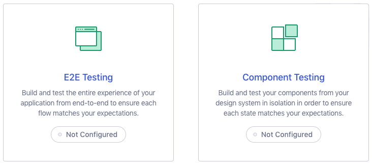
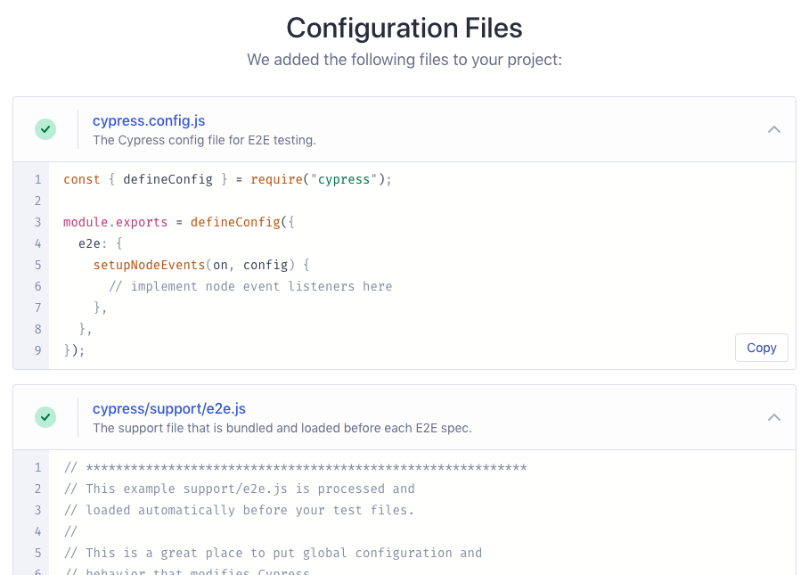
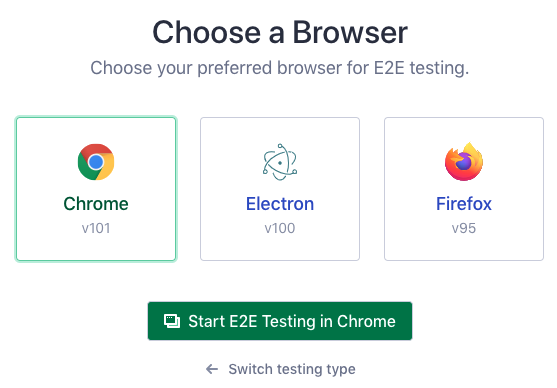
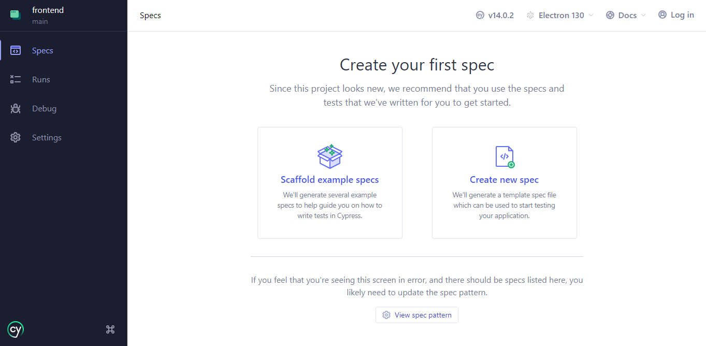

# Setting Up Cypress  

This guide walks you through installing and configuring Cypress in your project. Follow these steps to get started:  

---

## Step 1: Install Cypress  

Go to your project folder and run:  

```npm  
npm install cypress --save-dev  
```  

---

## Step 2: Open Cypress  

Once Cypress is installed, launch the Cypress app using:  

```npm  
npx cypress open  
```  

This will open the **Cypress Launchpad**.  

---

## Step 3: Configure Cypress  

In the Launchpad:  

1. **Choose a Testing Type**:  
   Decide whether you want to set up **E2E Testing** or **Component Testing**.  
   

2. **Quick Configuration**:  
   Cypress will show you the configuration files that will be created for your project.  
   

3. **Choose a Browser**:  
   Select the browser you want to use for testing.  
   

---

<details>
<summary>
Errors During Configuration?
</summary>
<p>

Does the error look similar to:

Change the Config File to TypeScript:
Update the `cypress.config.js` file to `cypress.config.ts`.

Reference: https://github.com/cypress-io/cypress/issues/23552

</p>
</details>

---

## Step 4: Create First Spec
Follow the guide to create a spec (testing file spec.cy.js)



Verify if `spec.cy.js` file is created in the path `cypress/e2e/'

---

## Step 5: Configure Workspace  

Update your `tsconfig.json` file to be properly configured as follows:  

```json title="tsconfig.json"
{
  "compilerOptions": {
    "baseUrl": ".",  
    "jsx": "react",  
    "target": "es5",  
    "lib": ["es5", "dom"],  
    "types": ["cypress", "node"],  
    "paths": {
      "@/*": ["./src/*"]
    },  
    "module": "commonjs",  
    "moduleResolution": "node",  
    "preserveValueImports": false  
  }
}
```  

Next, set the base URL for your project in `cypress.config.js`:  

```javascript title="cypress.config.js"
import { defineConfig } from "cypress";

export default defineConfig({
  e2e: {
    baseUrl: "http://192.168.0.162:5173/", // Replace with your project's local server address
  },
});
```  

With this setup, your workspace is now ready to run Cypress tests efficiently!  


---
For more detailed information, refer to the [official Cypress documentation](https://docs.cypress.io/)
