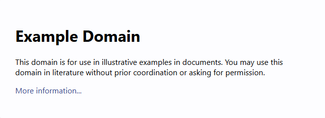

# Cypress Syntax Documentation

Learning the syntax of a new tool is best done through practical examples. Let's start by visiting [`example.com`](https://example.com) and performing some basic assertions.



In this example, we will:
1. Visit the `example.com` webpage.
2. Check if the text "Example Domain" exists.
3. Verify that this text is within an `h1` tag.

## Cypress Code

Below is the Cypress code to achieve the above steps:

```javascript

describe('Example Domain Test', () => {
  it('should visit example.com and check for "Example Domain" in h1 tag', () => {
    // visit the example.com page
    cy.visit('https://example.com');

    cy.get('h1') //check if there is a h1 tag
    .should('contain', 'Example Domain'); //assert if it contains text 'Example Domain'
  });
});
```
---

# Commonly used Cypress Functions

| **Function** | **Description**                                                                 | **Usage Example**                                     | **Parameters**                                                                 |
|--------------|---------------------------------------------------------------------------------|-------------------------------------------------------|------------------------------------------------------------------------------|
| `cy.visit()`| Navigates to a given URL.                                                      | `cy.visit('https://example.com')`                     | `url` (string): The URL to navigate to.                                      |
| `cy.get()`   | Gets one or more DOM elements by selector.                                     | `cy.get('button')`                                    | `selector` (string): The selector to query the DOM.                          |
| `cy.contains()` | Gets DOM elements containing the specified content.                     | `cy.contains('h1', 'Welcome')`                        | `selector` (string): The selector to query the DOM. `content` (string): The content to search for. |
| `cy.click()` | Clicks a DOM element.                                                         | `cy.get('button').click()`                            | None                                                                        |
| `cy.type()`  | Types text into a DOM element.                                                | `cy.get('input').type('Hello, World!')`               | `text` (string): The text to type into the element.                         |
| `cy.should()` | Makes an assertion about the current subject.                                 | `cy.get('button').should('be.visible')`               | `assertion` (string or function): The assertion to make. `value` (any): The value to assert against. |
| `cy.expect()`| Makes an assertion about a value.                                             | `cy.expect(true).to.be.true`                          | `actual` (any): The value to assert. `expected` (any): The expected value. |
| `cy.find()`  | Finds descendant DOM elements of the current subject.                         | `cy.get('ul').find('li')`                             | `selector` (string): The selector to query the descendants.                  |
| `cy.first()` | Gets the first DOM element within a set of DOM elements.                     | `cy.get('li').first()`                                | None                                                                        |
| `cy.last()`  | Gets the last DOM element within a set of DOM elements.                       | `cy.get('li').last()`                                 | None                                                                        |

### Detailed Parameters for `cy.should()`

The `cy.should()` function is highly versatile and can accept various parameters to make assertions. Here are some common parameters:

| **Assertion**       | **Description**                                                                 | **Example**                                                                 |
|---------------------|---------------------------------------------------------------------------------|-------------------------------------------------------------------------------|
| `be.visible`        | Asserts that the element is visible.                                          | `cy.get('button').should('be.visible')`                                       |
| `be.hidden`         | Asserts that the element is hidden.                                            | `cy.get('button').should('be.hidden')`                                        |
| `be.disabled`       | Asserts that the element is disabled.                                         | `cy.get('button').should('be.disabled')`                                      |
| `have.text`         | Asserts that the element has the specified text.                              | `cy.get('h1').should('have.text', 'Welcome')`                                |
| `have.value`        | Asserts that the element has the specified value.                              | `cy.get('input').should('have.value', 'testuser')`                           |
| `have.class`        | Asserts that the element has the specified CSS class.                         | `cy.get('div').should('have.class', 'active')`                               |
| `have.attr`         | Asserts that the element has the specified attribute.                         | `cy.get('a').should('have.attr', 'href', '/dashboard')`                       |
| `have.prop`         | Asserts that the element has the specified property.                          | `cy.get('input').should('have.prop', 'disabled', true)`                      |

- **Function Assertions**:
  - You can pass a function to make custom assertions.
  - Example:
  ```
  cy.get('button').should(($btn) => { expect($btn).to.have.text('Click Me'); })
  ```

- **Chaining Assertions**:
  - You can chain multiple assertions using `and`.
  - Example:
  ```
  cy.get('button').should('be.visible').and('have.text', 'Click Me')
  ```

---


# When to Use `cy.should()`, `cy.get()`, `cy.find()`, and `cy.contains()`

Understanding when to use each command ensures efficient and effective test writing. Let’s explore their distinct purposes in detail:

| **Command**   | **Purpose**                                                   | **When to Use**                                                                 |
|---------------|---------------------------------------------------------------|---------------------------------------------------------------------------------|
| `cy.should()` | Makes assertions about the current subject.                   | Use to validate the state, property, or visibility of an element.              |
| `cy.get()`    | Selects elements by their DOM selectors.                      | Use to locate elements by tags, classes, IDs, or attributes in the DOM.        |
| `cy.find()`   | Finds descendant elements of an already-selected element.     | Use when narrowing scope to child elements within a specific parent.           |
| `cy.contains()`| Finds elements containing specific text.                     | Use to locate elements where displayed text is a unique identifier.            |

### **Detailed Explanation with Examples**

#### **1. `cy.should()`**
The `cy.should()` command is used for assertions to verify that an element’s state or properties meet specific expectations.

- **Check visibility**:
  ```javascript
  cy.get('button').should('be.visible');
  ```
- **Assert element text**:
  ```javascript
  cy.get('h1').should('have.text', 'Welcome');
  ```
- **Custom assertions**:
  ```javascript
  cy.get('input').should(($input) => {
    expect($input).to.have.value('testuser');
  });
  ```

#### **2. `cy.get()`**
The `cy.get()` command is the starting point for selecting DOM elements using CSS selectors.

- **Select by class**:
  ```javascript
  cy.get('.btn-primary');
  ```
- **Select by attribute**:
  ```javascript
  cy.get('input[type="email"]');
  ```
- **Select by ID**:
  ```javascript
  cy.get('#login-form');
  ```

#### **3. `cy.find()`**
The `cy.find()` command is used to narrow down a selection to descendant elements.

- **Find a button within a specific container**:
  ```javascript
  cy.get('.modal').find('button.confirm');
  ```
- **Find all list items within a list**:
  ```javascript
  cy.get('ul.menu').find('li');
  ```

#### **4. `cy.contains()`**
The `cy.contains()` command is used to find elements containing specific text, making it ideal for dynamic content.

- **Find any element with specific text**:
  ```javascript
  cy.contains('Submit');
  ```
- **Find text within a specific tag**:
  ```javascript
  cy.contains('h1', 'Welcome Back');
  ```
- **Find text in a scoped container**:
  ```javascript
  cy.get('.navbar').contains('Logout');
  ```

### **Combining Commands**

You can combine these commands to create more complex queries and validations.

- **Example 1: Find a button inside a modal and validate its text**:
  ```javascript
  cy.get('.modal').find('button').should('have.text', 'Confirm');
  ```

- **Example 2: Verify dynamic text inside a container**:
  ```javascript
  cy.get('.content').contains('Welcome').should('be.visible');
  ```

For more detailed information, refer to the [official Cypress documentation](https://docs.cypress.io/)