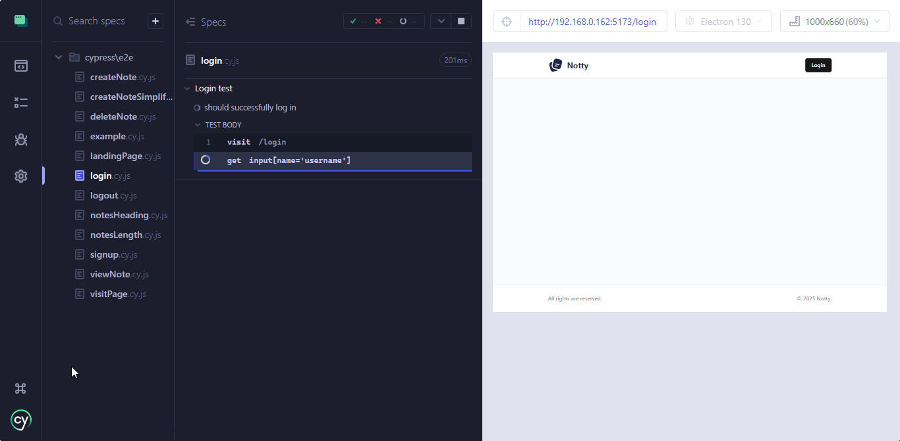
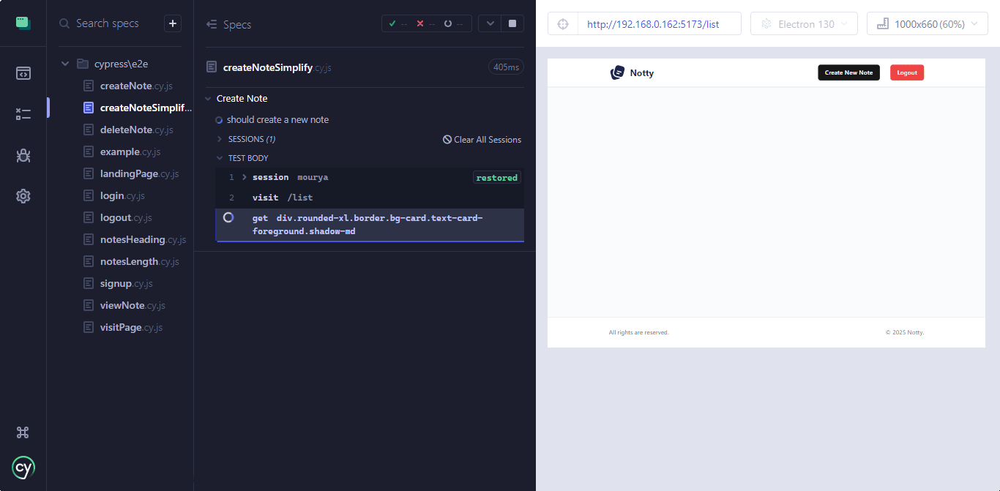

## Overview
👋 Welcome! In this section, we'll explore detailed examples to understand when and where specific Cypress functions should be used. By the end, you'll have a solid grasp of automating tests effectively! 🚀

### File Setup
- Test files should have the extension `.cy.ts` or `.cy.js`.
- The syntax for TypeScript and JavaScript is the same.
- All test files should be located in the `cypress/e2e/` folder.

🌟 **GitHub Repository**: You can find the testing files in the [GitHub repository](https://github.com/moonbuild/cypressNotty) repository.

[](https://github.com/moonbuild/cypressNotty) 

---

## Automating Login
Let's start with a simple login example:

```javascript title="login.cy.js"
describe('Login test', () => {
  it('should successfully log in', () => {
    cy.visit('/login');
    cy.get("input[name='username']").type('mourya');
    cy.get("input[name='password']").type('password123');
    cy.get("button[type='submit']").click();
    cy.contains('Login successful', {timeout:20000}).should('be.visible');
    cy.url().should('include', '/list');
  });
});
```
1. **Test Suite**: Tests the "Login" feature.  
2. **Test: 'should successfully log in'**:  
   - Visits `/login`.  
   - Enters "mourya" in the username and password fields.  
   - Clicks the "Submit" button.  
   - Verifies the success message and checks if redirected to `/list`.  
3. **Assertions**: Confirms visibility of "Login successful" and URL includes `/list`.
:::tip
The timeout option sets how long (in milliseconds) Cypress will wait for the element to appear before giving up.
:::


### Optimizing Login with Sessions
💡 Logging in repeatedly can be time-consuming for large applications. Cypress offers the `cy.session()` function to cache session data.

#### Example:
```javascript
cy.session('mourya', () => {
  cy.visit('/login');
  cy.get("input[name='username']").type('mourya');
  cy.get("input[name='password']").type(`password123`);
  cy.get("button[type='submit']").click();
  cy.contains('Login successful', { timeout: 20000 }).should('be.visible');
  cy.url({ timeout: 20000 }).should('include', '/list');
});

```
1. **Purpose**: This code sets up a session for the user "mourya" using `cy.session`.  
2. **How it works**:  
   - `cy.session` creates and caches a session identified by the key `'mourya'`.  
   - Inside the session callback, it performs the login steps (visiting `/login`, entering credentials, and verifying success).  
   - On subsequent calls with the same key (`'mourya'`), Cypress restores the cached session (cookies, local storage, etc.) instead of repeating the login steps.  
3. **Key Benefits**:  
   - Reduces test runtime by skipping redundant login steps.  
   - Ensures the test starts in a pre-authenticated state.  
4. **Assertions**:  
   - Checks for the success message and the correct post-login URL.  

---

### Creating a Custom Command
Since login is a repetitive task, we can create a custom Cypress command:
First rename all `.js` files in `cypress/support` folder to `.ts`  
1. **Navigate to:** `cypress/support/commands.ts`.
2. **Add the following code:**

```javascript title="commands.js"
const login = (email, password) => {
  cy.session(email, () => {
    cy.visit('/login');
    cy.get("input[name='username']").type(email);
    cy.get("input[name='password']").type(`${password}`);
    cy.get("button[type='submit']").click();
    cy.contains('Login successful', { timeout: 20000 }).should('be.visible');
    cy.url({ timeout: 20000 }).should('include', '/list');
  }, {
    cacheAcrossSpecs: true
  });
};

Cypress.Commands.add('login', login);
```

3. **Ensure import exists:** In `cypress/support/e2e.ts`, verify the following:
```javascript
import './commands';
```
🎉 Now you can use the `cy.login` command in your tests!

#### Usage:
```javascript title="visitPage.cy.js"
describe('Visit Page', () => {
  it('should visit page', () => {
    cy.login('mourya', 'password123');
    cy.visit('/list');
  });
});
```
:::info
<!-- ### How It Works -->
- **When the session exists:** Cypress restores it using stored cookies and local/session storage.
- **When it doesn't exist:** Cypress runs the login function and saves the session for future use.
:::
---

## Testing Registration and Login
Here's an example to test user registration and subsequent login:

```javascript title="signup.cy.js"
describe('New User Registration', () => {
  it('should register a new user and log in', () => {
    const username = 'naruto';
    const password = 'uzumakiNaruto';

    // register
    cy.visit('/register');
    cy.get("input[name='full_name']").type('naruto22');
    cy.get("input[name='username']").type(username);
    cy.get("input[name='password']").type(password);
    cy.contains('button', 'Create account').click();
    cy.contains('Registration successful!', { timeout: 20000 }).should('be.visible');
    cy.url().should('include', '/login');
    cy.log('Registration successful');

    // login
    cy.visit('/login');
    cy.get("input[name='username']").type(username);
    cy.get("input[name='password']").type(password);
    cy.get("button[type='submit']").click();
    cy.contains('Login successful', { timeout: 20000 }).should('be.visible');
    cy.url().should('include', '/list');
    cy.log('Login successful');
  });
});
```
1. **Test Suite**: Tests the "New User Registration" and subsequent login.  

2. **Test: 'should register a new user and log in'**:  
   - **Registration**:  
     - Visits `/register`.  
     - Enters a full name, username (`naruto`), and password (`uzumakiNaruto`).  
     - Clicks the "Create account" button.  
     - Verifies the "Registration successful!" message and checks redirection to `/login`.  
   - **Login**:  
     - Visits `/login`.  
     - Enters the newly registered username and password.  
     - Clicks the "Submit" button.  
     - Verifies the "Login successful" message and checks redirection to `/list`.  
3. **Assertions**:  
   - Confirms successful registration with the correct message and URL (`/login`).  
   - Confirms successful login with the correct message and URL (`/list`).  

---

## Viewing Notes
Here's how you can test viewing a note:


```javascript title="viewNote.cy.js"
describe('View Note', () => {
  it('Title should be disabled', () => {
    cy.login('mourya', 'uzumakiNaruto');
    cy.visit('/list');

    cy.get('button.border.border-input', { timeout: 30000 })
      .filter(':has(svg.tabler-icon-eye)')
      .last()
      .click();

    cy.get("input[placeholder='Title']")
      .should('be.disabled');

    cy.contains('button', 'Close')
      .should('exist')
      .click();
  });
});
```
1. **Test Suite**: Tests the "View Note" feature.  
2. **Test: 'Title should be disabled'**:  
   - Restores the user session (`cy.login`) and visits `/list`.  
   - Finds buttons with the class `border.border-input`.  
   - Filters these to select one containing an SVG (eye icon), selects the last button, and clicks it.  
   - Verifies the title field (`placeholder='Title'`) is disabled.  
   - Ensures the "Close" button exists and clicks it to exit.  
3. **Assertions**: Confirms session restoration, correct button interaction, disabled title field, and "Close" button functionality.

---

## Handling Dynamic Routing
Here's how to test a landing page that dynamically redirects based on session state:


```javascript title="landingPage.cy.js"
describe('Landing Page Renders', () => {
  it('redirects to /list if session exists', () => {
    cy.login('mourya', 'mourya');
    cy.visit('/');
    cy.contains('button', 'Get Started')
      .should('exist')
      .click();
    cy.url().should('include', '/list');
  });

  it('redirects to /register if session does not exist', () => {
    cy.visit('/');
    cy.contains('button', 'Get Started')
      .should('exist')
      .click();
    cy.url().should('include', '/register');
  });
});
```
1. **Test Suite**: Tests the "Landing Page" behavior based on session state.
2. **Test1 Redirect to `/list`**:
   - The user logs in with `cy.login` to establish a session.
   - Verifies on visiting `/`, clicking "Get Started" redirects to `/list`.  
3. **Test2 Redirect to `/register`**:
   - Without logging in, visits `/` .
   - Verfiies clicking "Get Started" button redirects to `/register`.  
4. **Assertions**:
   - Ensures the "Get Started" button is visible before interacting.
   - Validates the URL to confirm the correct redirection.
---

### Creating a Note

Alright, let's get more complex and create a note!

```javascript title="createNote.cy.js"
describe("Create Note", () => {
    it("should create note when title and body is given", () => {
        cy.login('mourya', 'mourya');
        cy.visit('/list');

        let initialCount;
        cy.get('div.rounded-xl.border.bg-card.text-card-foreground.shadow-md', {timeout:30000})
            .its('length')
            .then((count) => {
                initialCount = count;
                cy.log(`Initial number of elements: ${initialCount}`);
        });
        initialCount = initialCount+1

        cy.contains('button', 'Create New Note', { timeout: 30000 })
        .should('exist')
        .click();

        const title = "Fried Rice";
        const info = "I loved the taste in the new shop";
        cy.get('input[placeholder="Title"]', { timeout: 30000 }).type(title);
        cy.get('div.ql-editor p').clear().type(info);
        cy.contains('button', 'Create Note').click();

        cy.get('div.rounded-xl.border.bg-card.text-card-foreground.shadow-md', { timeout: 30000 })
            .its('length')
            .then((newCount) => {
                cy.log(`New number of elements: ${newCount}`);
                expect(newCount).to.eq(initialCount);
            });
    });
});
```

1. **Test Suite**: Tests the "Create Note" functionality.  
2. **Test1 Create Note**:  
   - Logs in using `cy.login` and visits `/list`.  
   - Counts the number of notes before creating a new one.  
   - Clicks the "Create Note" button, fills in the required data, and submits the form.  
   - Verifies the count of notes increases by one after creation.  
3. **Test2 Missing Title Error**:  
   - Logs in using `cy.login` and visits `/list`.  
   - Clicks the "Create Note" button.  
   - Leaves the "Title" field empty and submits the form.  
   - Verifies the "Title" field is marked invalid.  
4. **Assertions**:  
   - Ensures the count of notes increases when a valid note is created.  
   - Confirms the "Title" field is invalid when left empty.  

Although we could just assert from the notification message, it's better to actually count and verify because it also checks if the website refreshes the `/list` automatically.

---

### Simplifying `Create Note` Code:

```javascript title="createNoteSimplify.cy.js"
describe('Create Note', () => {
    it('should create a new note', () => {
        cy.login('mourya', 'mourya');
        cy.visit('/list');

        cy.get('div.rounded-xl.border.bg-card.text-card-foreground.shadow-md', {timeout: 40000})
        .then((notesBefore) => {
            const countBefore = notesBefore.length;
            const title = "Fried Rice";
            const info = "I loved the taste in the new shop";
            cy.log(`Initial number of notes: ${countBefore}`);

            cy.contains('button', 'Create New Note', { timeout: 30000 })
            .should('exist')
            .click();

            cy.get('input[placeholder="Title"]', { timeout: 30000 }).type(title);
            cy.get('div.ql-editor p').clear().type(info);
            cy.contains('button', 'Create Note').click();

            cy.get('div.rounded-xl.border.bg-card.text-card-foreground.shadow-md')
            .should((notesAfter) => {
                expect(notesAfter.length).to.eq(countBefore + 1);
            });
        });
    });
});

```
### Explanation:

1. **Test Suite**: Tests the "Create Note" functionality.
2. **Test: 'should create a new note'**:
   - Logs in using `cy.login` with valid credentials.
   - Visits `/list`, the page where notes are listed.
   - Captures the current number of notes displayed using `cy.get` and the specified selector.
   - Here, `.then((notesBefore) => { ... })` captures the list of notes currently displayed on the page and allows storing the `length` in a variable (`countBefore`) for further use in assertions.
   - Defines the title and content for the new note
   - Clicks the **"Create New Note"** button to open the form.
   - Fills in the "Title" and "Body" fields.
   - Submits the form by clicking the **"Create Note"** button.
   - Verifies the note count increased by 1, ensuring the note was created successfully.
3. **Assertions**:
   - Confirms the "Create New Note" button exists.
   - Validates the final note count matches `countBefore + 1`.



---

## 📌 Github Repository

🎉 That wraps it up! For more diverse examples, visit the [GitHub repository](https://github.com/moonbuild/cypressNotty). Happy testing! 🧪✨

