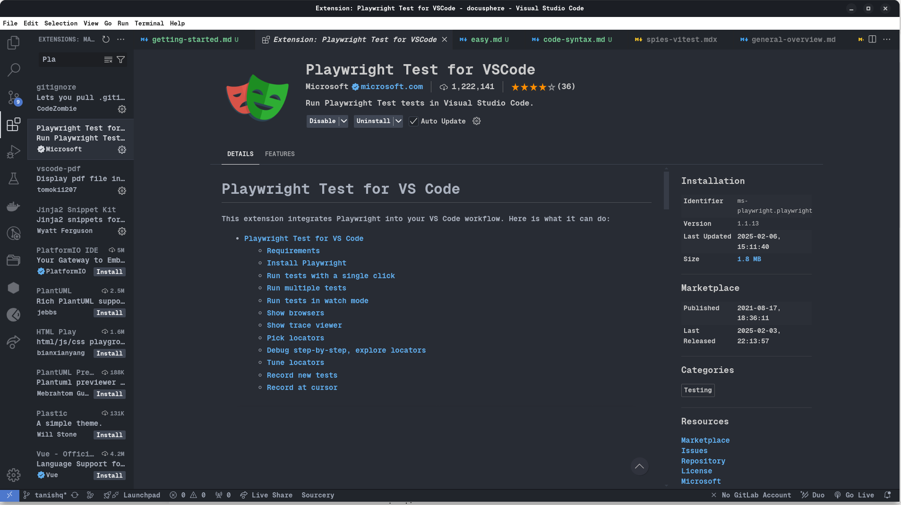
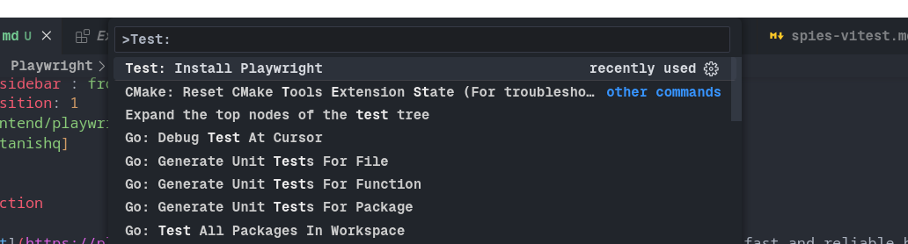
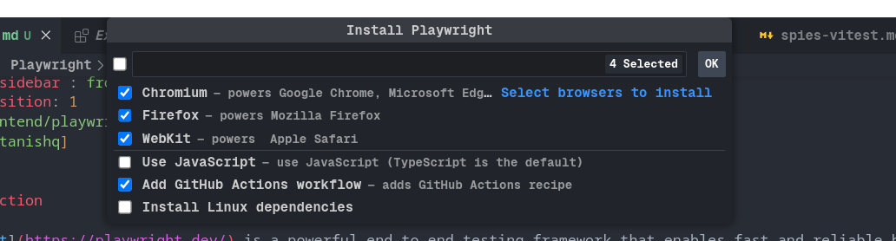
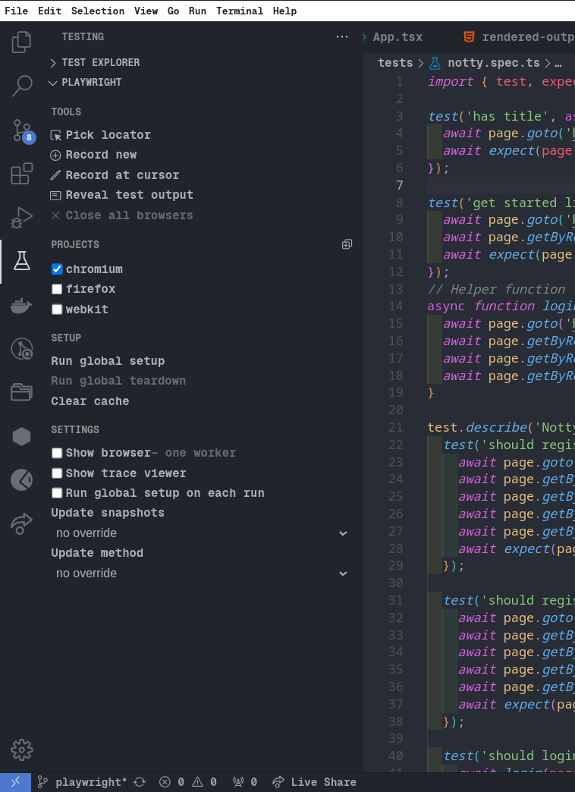
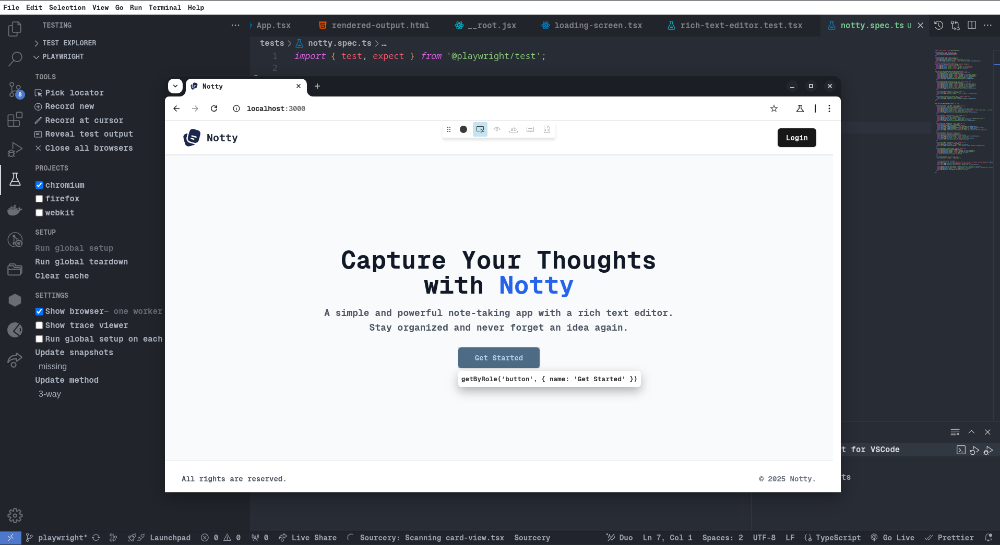
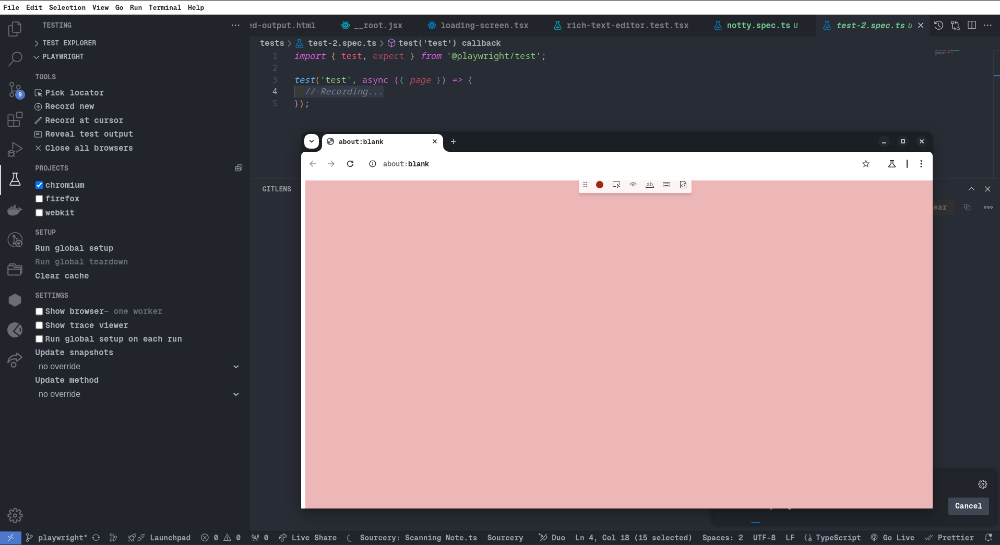
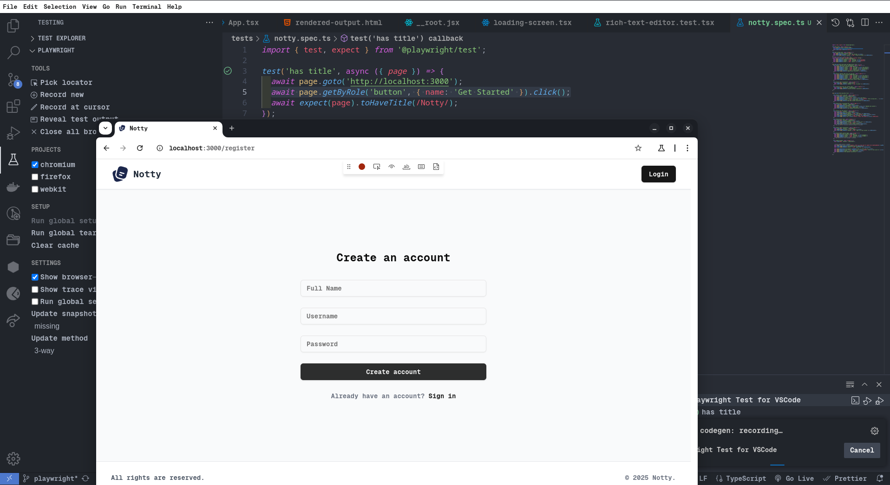
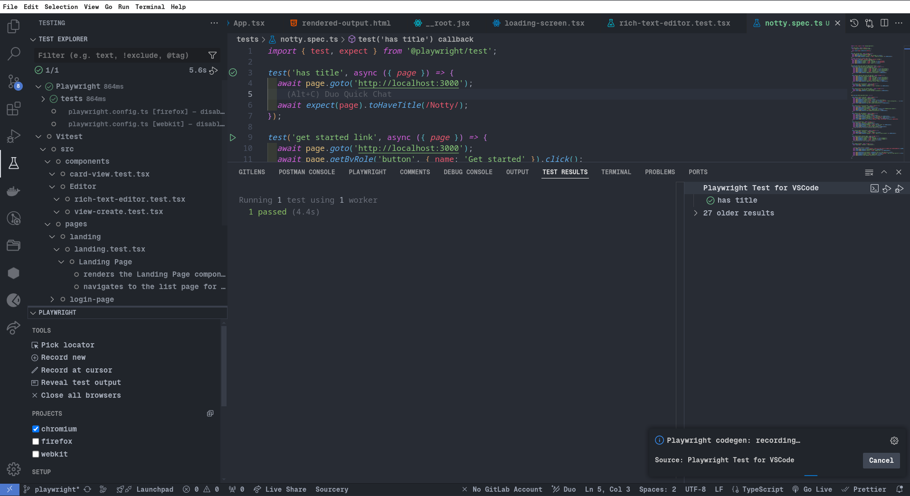

## Introduction

[Playwright](https://playwright.dev/) is a powerful end-to-end testing framework that enables fast and reliable browser automation. This guide will walk you through installing Playwright using the official VS Code extension and introduce key features like **Pick Locator**, **Record New**, and **Record at Cursor**.  
  
  
## Installing Playwright via VS Code Extension

1. Open **VS Code**.
2. Navigate to the **Extensions Marketplace** (`Ctrl + Shift + X` on Windows/Linux, `Cmd + Shift + X` on macOS).
3. Search for **Playwright**.
4. Click **Install** on the **Playwright Test for VS Code** extension.

5. Navigate to the **Command Palette** (`Ctrl + Shift + P` on Windows/Linux, `Cmd + Shift + X` on macOS)
6. Search for **Test: Install Playwright**.

7. Select all the browers or any of your choice. Click Ok

8. **Playwright is successfully installed!**.

## Usage

 Navigate to Testing panel. Playwright will be ready for writing test cases. The feature of playwright makes writing test case fast.

## Key Features

### Pick Locator
The **Pick Locator** tool helps you quickly find and generate locators for elements on the page.

- Click on the **Pick Locator** button in the Playwright extension sidebar.
- Hover over elements in the browser preview.
- Click an element to generate a **locator query**, which you can use in your test.
- The locator appears in the **VS Code terminal/output panel**, ready for copying and also available in the open brower.

### Record New
The **Record New** feature allows you to generate test scripts interactively.

- Click **Record New** in the Playwright extension.
- A browser window opens (also a new test file is generated) where you can interact with your application.
- Every action (click, input, navigation) is recorded and converted into a Playwright script.
- Once finished, the script appears in **VS Code**, ready for execution and refinement.

### Record at Cursor
The **Record at Cursor** feature lets you insert recorded interactions into an existing Playwright test.

- Place your cursor in an existing test script where you want to insert new interactions.
- Click **Record at Cursor** in the Playwright extension.
- Perform interactions in the browser.
- The recorded steps are inserted directly at the cursor position in your test script.

## Running Tests
After creating a test, you can run it directly from VS Code:

- Click the **Run** button above the test function.
- Use the Playwright Test explorer in the VS Code sidebar.

---

For further details, visit the official [Playwright documentation](https://playwright.dev/docs/intro).

