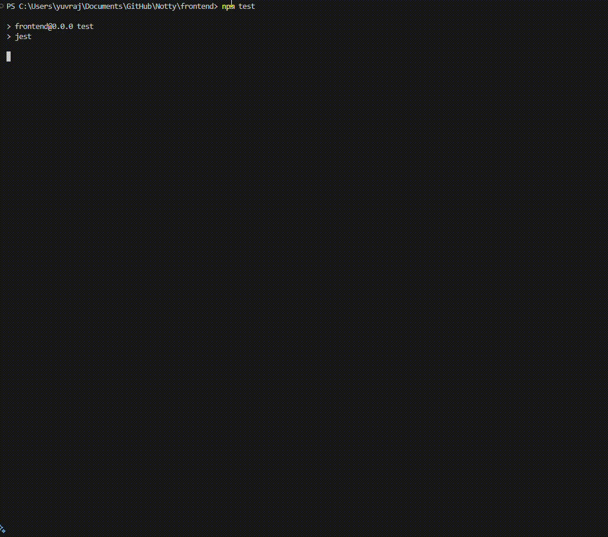
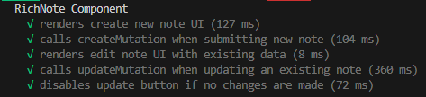
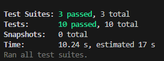

# Testing Examples
## Testing Functions

```typescript
// consider the following function which adds tow numbers and returns the sum 
export function addNumbers(a: number, b: number): number {
  return a + b;
}

// Testing the function
import { addNumbers } from './mathUtils';

describe('addNumbers function', () => {
  test('should return the correct sum', () => {
    expect(addNumbers(2, 3)).toBe(5);
    expect(addNumbers(-1, 1)).toBe(0);
  });

  test('should handle negative numbers', () => {
    expect(addNumbers(-5, -3)).toBe(-8);
    expect(addNumbers(-2, 4)).toBe(2);
  });
});

```

## Testing Classes

```typescript
// Trial class with two methods
export class Trial {
    add(a: number, b: number) {
      return a + b;
    }
  
    isEven(num:number) {
      return num % 2 === 0;
    }
  }


// Testing the Functions/Methods in the above class
describe('Trial Class', () => {
  let trial: Trial; // Explicitly define the type

  //Before each test, beforeEach creates a new instance of Trial. This ensures each test runs independently, preventing potential cross-test interference.

  beforeEach(() => {
    trial = new Trial();// Runs before each test, ensuring a fresh instance
  });

  test('add method should return the correct sum', () => {
    expect(trial.add(2, 3)).toBe(5);
    expect(trial.add(-1, 1)).toBe(0);
    expect(trial.add(0, 0)).toBe(0);
  });

  test('isEven method should correctly determine even numbers', () => {
    expect(trial.isEven(2)).toBeTruthy();
    expect(trial.isEven(3)).toBeFalsy();
    expect(trial.isEven(0)).toBe(true);
    expect(trial.isEven(-4)).toEqual(true);
  });
});
```
## Testing Exceptions ansd Asynchronous Functions 


### Jest Example with `.toThrow()`, `.toThrowError()`, and `.resolves.toEqual()`

```typescript
export function divide(a: number, b: number): number {
  if (b === 0) throw new Error('Cannot divide by zero');
  return a / b;
}

export async function fetchData(): Promise<string> {
  return new Promise((resolve) => setTimeout(() => resolve('Success'), 100));
}

// Testing the above test:
import { divide, fetchData } from './mathUtils';

describe('Jest Matchers Example', () => {
  test('should throw an error when dividing by zero', () => {
    expect(() => divide(4, 0)).toThrow();
    expect(() => divide(4, 0)).toThrowError('Cannot divide by zero');
  });

  test('should resolve with correct data', async () => {
    await expect(fetchData()).resolves.toEqual('Success');
  });
});
```

---

## Testing React - applications

### Test Explanation

In this test suite, we are testing the `RichNote` component, which allows users to create and edit notes. The tests cover both creating new notes and updating existing ones, simulating user interactions, and verifying the expected outcomes. The `jest.mock` function is used to mock the `useNotes` service hook and the `react-toastify` notifications to isolate the component from external dependencies. 

1. **`renders create new note UI`**: This test checks that the component properly renders the UI elements for creating a new note, specifically ensuring the "Title" input field and the "Create New Note" text are visible.

2. **`calls createMutation when submitting new note`**: Here, we simulate a user filling out the "Title" field and clicking the "Create Note" button. It ensures the `createMutationMock` is called to trigger the note creation logic and that a success toast notification appears.

3. **`renders edit note UI with existing data`**: This test checks if the component correctly displays the existing note's data when the `note` prop is passed, particularly the "Title" input field should show the current note's title.

4. **`calls updateMutation when updating an existing note`**: Similar to the creation test, but for updating an existing note, this test ensures the `updateMutationMock` is called and verifies the success message using `toast.success` when the "Update Note" button is clicked.

5. **`disables update button if no changes are made`**: This test ensures that the "Update Note" button is disabled (with a specific class for styling) when no changes are made to the note.

These tests focus on the component's functionality, ensuring it behaves correctly for both creating and editing notes, handling state changes, and showing appropriate notifications. The use of mocks allows for isolated testing without relying on actual API calls or external services.

### Testing code

```tsx
import { render, screen, fireEvent } from "@testing-library/react";
import { toast } from "react-toastify";
import RichNote from "@/components/Editor/view-create";
import { useNotes } from "@/services/notes.service-hook";
import '@testing-library/jest-dom'

jest.mock("@/services/notes.service-hook"); // Mock the notes service
jest.mock("react-toastify", () => ({
  toast: {
    success: jest.fn(),
  },
}));

describe("RichNote Component", () => {
  const mockOnClose = jest.fn();
  let createMutationMock: jest.Mock;
  let updateMutationMock: jest.Mock;

  beforeEach(() => {
    createMutationMock = jest.fn();
    updateMutationMock = jest.fn();

    (useNotes as jest.Mock).mockReturnValue({
      createMutation: {
        mutate: createMutationMock,
        isPending: false,
      },
      updateMutation: {
        mutate: updateMutationMock,
        isPending: false,
      },
    });
  });

  test("renders create new note UI", () => {
    render(<RichNote onClose={mockOnClose} />);

    // Replaced `toBeInTheDocument` with basic checks
    expect(screen.getByPlaceholderText("Title")).toBeTruthy();
    expect(screen.getByText("Create New Note")).toBeTruthy();
  });

  test("calls createMutation when submitting new note", () => {
    render(<RichNote onClose={mockOnClose} />);

    fireEvent.change(screen.getByPlaceholderText("Title"), {
      target: { value: "New Note" },
    });

    fireEvent.click(screen.getByRole("button", { name: "Create Note" }));

    expect(createMutationMock).toHaveBeenCalled();
    expect(toast.success).toHaveBeenCalledWith("New Note created successfully!.");
  });

  test("renders edit note UI with existing data", () => {
    const note = {
      note_id: 1,
      title: "Existing Note",
      body: "This is an existing note",
      author: 1,
      created: "2024-02-05T10:00:00Z",
      modified: "2024-02-05T12:00:00Z",
    };

    render(<RichNote note={note} onClose={mockOnClose} />);

    expect(screen.getByPlaceholderText("Title").getAttribute('value')).toBe("Existing Note");
    expect(screen.getByText("Edit Note")).toBeTruthy();
  });

  test("calls updateMutation when updating an existing note", () => {
    const note = {
      note_id: 1,
      title: "Existing Note",
      body: "This is an existing note",
      author: 1,
      created: "2024-02-05T10:00:00Z",
      modified: "2024-02-05T12:00:00Z",
    };

    render(<RichNote note={note} onClose={mockOnClose} />);

    fireEvent.change(screen.getByPlaceholderText("Title"), {
      target: { value: "Updated Note" },
    });

    fireEvent.click(screen.getByRole("button", { name: "Update Note" }));

    expect(updateMutationMock).toHaveBeenCalled();
    expect(toast.success).toHaveBeenCalledWith("Note updated successfully!.");
  });

  test("disables update button if no changes are made", () => {
    const note = {
      note_id: 1,
      title: "Existing Note",
      body: "This is an existing note",
      author: 1,
      created: "2024-02-05T10:00:00Z",
      modified: "2024-02-05T12:00:00Z",
    };
  
    render(<RichNote note={note} onClose={mockOnClose} />);
  
    const updateButton = screen.getByRole("button", { name: "Update Note" });
    expect(updateButton).toHaveClass("disabled:opacity-50");
  });
  
});
```


## Understanding the Tests 🕵️‍♂️:

### 1) Modules and functions used in testing
```tsx
import { render, screen, fireEvent } from "@testing-library/react";
import { toast } from "react-toastify";
import RichNote from "@/components/Editor/view-create";
import { useNotes } from "@/services/notes.service-hook";
import '@testing-library/jest-dom'
```

- **`render, screen, fireEvent` (@testing-library/react)** – Helps render components, query elements, and simulate user interactions.  
- **`toast` (react-toastify)** – Displays toast notifications; mocked in tests to verify success messages.  
- **`RichNote`** – The component under test, allowing users to create and edit notes.  
- **`useNotes`** – A custom hook for handling note creation and updates; mocked to avoid actual API calls. It provides functions and states such as createMutation (for creating a new note) and updateMutation (for updating an existing note).
- **`@testing-library/jest-dom`** – Extends Jest with custom matchers for better DOM assertions in tests.  
---

### 2) Mocking the useNotes 

```tsx
jest.mock("@/services/notes.service-hook"); // Mock the notes service
jest.mock("react-toastify", () => ({
  toast: {
    success: jest.fn(),
  },
}));

describe("RichNote Component", () => {
  const mockOnClose = jest.fn();
  let createMutationMock: jest.Mock;
  let updateMutationMock: jest.Mock;
```

This code is setting up a **test environment** for the `RichNote` component by **mocking external dependencies** and defining test configurations.

Mocking External Dependencies

```typescript
jest.mock("@/services/notes.service-hook"); // Mock the notes service
```
This mocks the useNotes service, preventing actual API calls during testing. Instead of calling a real backend, the test will use a fake version of useNotes.
``` tsx
jest.mock("react-toastify", () => ({
  toast: {
    success: jest.fn(),
  },
}));
```
This mocks the `toast.success` function from `react-toastify`, ensuring that toasts are not actually displayed in tests.
The `jest.fn()` function creates a mock function to track when and how toast.success is called.

```tsx
const mockOnClose = jest.fn();
```
This mock function simulates the `onClose` prop passed to `RichNote`. It allows the test to verify if onClose was called when expected.

```tsx
let createMutationMock: jest.Mock;
let updateMutationMock: jest.Mock;
```
These mock functions will simulate the `createMutation` and `updateMutation` functions from the useNotes hook.

---
### 3) Initilising the test
```tsx
beforeEach(() => {
    createMutationMock = jest.fn();
    updateMutationMock = jest.fn();

    (useNotes as jest.Mock).mockReturnValue({
      createMutation: {
        mutate: createMutationMock,
        isPending: false,
      },
      updateMutation: {
        mutate: updateMutationMock,
        isPending: false,
      },
    });
  });
```

#### Understanding the `beforeEach` Hook  

The `beforeEach` block runs **before every test case** in the `describe` block. It ensures that the test starts with a fresh setup.

```typescript
createMutationMock = jest.fn();
updateMutationMock = jest.fn();
```

`jest.fn()` creates a new mock function before each test. `createMutationMock` and `updateMutationMock` simulate function calls for creating and updating notes.
This prevents test cases from interfering with each other by reusing old mock data.


Mocking the useNotes Hook:
```tsx
(useNotes as jest.Mock).mockReturnValue({
  createMutation: {
    mutate: createMutationMock,
    isPending: false,
  },
  updateMutation: {
    mutate: updateMutationMock,
    isPending: false,
  },
});
```

The `useNotes` hook is mocked to return a controlled response instead of making actual API calls.

`createMutation.mutate`: Calls `createMutationMock` when creating a new note.

`updateMutation.mutate`: Calls `updateMutationMock` when updating a note.

`isPending`: `false`: Simulates that no API request is currently in progress.

---

### 4) Test Cases

#### 📝 Understanding the Test: "renders create new note UI" 

```ts
test("renders create new note UI", () => {
    render(<RichNote onClose={mockOnClose} />);

    // Replaced toBeInTheDocument with basic checks
    expect(screen.getByPlaceholderText("Title")).toBeTruthy();
    expect(screen.getByText("Create New Note")).toBeTruthy();
  });
```

Rendering the Component
```typescript
render(<RichNote onClose={mockOnClose} />);
```
This renders the `RichNote` component inside a virtual DOM provided by `@testing-library/react`.
The `onClose` prop is passed as `mockOnClose`, a mock function that helps verify if the close action is triggered.

```tsx
expect(screen.getByPlaceholderText("Title")).toBeTruthy();
```

This finds an input field with the placeholder text **"Title"** and ensures that it exists.

```tsx
expect(screen.getByText("Create New Note")).toBeTruthy();
```
This verifies that the **"Create New Note"** text is present in the component. This ensures that the UI correctly displays the heading when creating a new note.


markdown
Copy
Edit
#### 🤔 When Will This Test Fail?  

The test **"renders create new note UI"** will fail if any of the following conditions occur:

1️⃣ **The `RichNote` component does not render correctly**  
   - If there is an error preventing the component from mounting.

2️⃣ **The input field with placeholder `"Title"` is missing**  
   - If the placeholder text is changed or removed.  
   - Example: `<input placeholder="Enter Title" />` instead of `"Title"`.

3️⃣ **The "Create New Note" text is missing or changed**  
   - If the component is updated and the text `"Create New Note"` is modified or removed.  
   - Example: `"Add a New Note"` instead of `"Create New Note"`.

4️⃣ **The component renders in edit mode instead of create mode**  
   - If a note is mistakenly passed as a prop, causing the UI to switch to **edit mode** instead of **create mode**.

---


#### 📝 Understanding the Test: "calls createMutation when submitting new note"
```tsx 
test("calls createMutation when submitting new note", () => {
    render(<RichNote onClose={mockOnClose} />);

    fireEvent.change(screen.getByPlaceholderText("Title"), {
      target: { value: "New Note" },
    });

    fireEvent.click(screen.getByRole("button", { name: "Create Note" }));

    expect(createMutationMock).toHaveBeenCalled();
    expect(toast.success).toHaveBeenCalledWith("New Note created successfully!.");
  });
```
This test ensures that when a new note is submitted, the **`createMutation` function is called** and a **success toast message is displayed**.

```tsx
 fireEvent.change(screen.getByPlaceholderText("Title"), {
      target: { value: "New Note" },
    });
```
- **Finds the input field** using its `placeholder="Title"`.
- **Simulates a user typing** `"New Note"` into the input field.
- Updates the component’s state (`title` in `useState`).

```tsx
fireEvent.click(screen.getByRole("button", { name: "Create Note" }));
```
- **Finds the button** with the accessible role `"button"` and text `"Create Note"`.
- **Simulates a click event**, triggering the `handleSubmit` function in `RichNote`.

```tsx
expect(createMutationMock).toHaveBeenCalled();
```

- **Checks if `createMutation.mutate(noteData)` was called**.
- This confirms that the `createMutation` function was triggered to **create a new note**.

 ```tsx
 expect(toast.success).toHaveBeenCalledWith("New Note created successfully!.");
 ```
 - **Verifies that a success toast message was displayed** after the note was created.

 #### 🤔 **When Does This Test Fail?**

This test will fail in the following cases:

1️⃣. **Title field does not update** – If the `fireEvent.change` does not correctly modify the title field value to "New Note".

2️⃣. **"Create Note" button is missing** – If the button is not rendered, either because of a conditional rendering issue or incorrect markup.

3️⃣. **Button text is incorrect** – If the button text is not "Create Note", causing the test to fail when trying to locate it using `screen.getByRole`.

4️⃣. **createMutationMock is not called** – If the `createMutation.mutate` function is not invoked when the form is submitted.

5️⃣. **Success toast is not triggered** – If the `toast.success` function is not called with the expected success message ("New Note created successfully!"), due to either a failed mutation or missing toast configuration.


---

 #### 📝 Understanding the Test: "renders edit note UI with existing data"

 ```tsx
 test("renders edit note UI with existing data", () => {
    const note = {
      note_id: 1,
      title: "Existing Note",
      body: "This is an existing note",
      author: 1,
      created: "2024-02-05T10:00:00Z",
      modified: "2024-02-05T12:00:00Z",
    };

    render(<RichNote note={note} onClose={mockOnClose} />);

    expect(screen.getByPlaceholderText("Title").getAttribute('value')).toBe("Existing Note");
    expect(screen.getByText("Edit Note")).toBeTruthy();
  });
```

This test ensures that when an **existing note** is passed as a prop to the `RichNote` component, the correct data is displayed in the UI.
- The **title field** is pre-filled with the note's existing title.
- The **component correctly renders in "Edit Mode"** instead of "Create Mode".


```tsx
const note = {
  note_id: 1,
  title: "Existing Note",
  body: "This is an existing note",
  author: 1,
  created: "2024-02-05T10:00:00Z",
  modified: "2024-02-05T12:00:00Z",
};
```

A mock note object is created with a predefined `title`, `body`, and `note_id`. This simulates a real note stored in a database.
The created and modified timestamps indicate when the note was `created` and `last updated`.

```tsx
expect(screen.getByPlaceholderText("Title").getAttribute('value')).toBe("Existing Note");
```

Finds the input field with the placeholder `"Title"`. Retrieves its current value using `.getAttribute('value')`.
Asserts that the value is "Existing Note", ensuring the input is pre-filled.

```tsx
expect(screen.getByText("Edit Note")).toBeTruthy();
```
Search for the text "Edit Note" in the rendered component. Assert that the text is present on the screen.
This confirms that the component is in `Edit Mode` instead of `Create Mode`.

#### 🤔 When Does This Test Fail?

This test will **fail** under the following conditions:

**1️⃣ The title input field is empty**
- The test expects the input field to contain `"Existing Note"`, but if it's empty, the test fails.
  
 **2️⃣ The title input field has incorrect text**
- If the title is `"Wrong Note"` or any value other than `"Existing Note"`, the assertion will fail.

**3️⃣ The title input field is missing**
- If `getByPlaceholderText("Title")` cannot find the input field, the test will throw an error.

**4️⃣ The component displays `"Create New Note"` instead of `"Edit Note"`**
- If the component is not recognizing the note as an existing one, it might show the wrong header.

**5️⃣ The `"Edit Note"` text is missing from the UI**
- If `getByText("Edit Note")` cannot find the text, it means the component is not in Edit Mode.


---

#### 📝 **Understanding the Test: calls updateMutation when updating an existing note**
```tsx
test("calls updateMutation when updating an existing note", () => {
    const note = {
      note_id: 1,
      title: "Existing Note",
      body: "This is an existing note",
      author: 1,
      created: "2024-02-05T10:00:00Z",
      modified: "2024-02-05T12:00:00Z",
    };

    render(<RichNote note={note} onClose={mockOnClose} />);

    fireEvent.change(screen.getByPlaceholderText("Title"), {
      target: { value: "Updated Note" },
    });

    fireEvent.click(screen.getByRole("button", { name: "Update Note" }));

    expect(updateMutationMock).toHaveBeenCalled();
    expect(toast.success).toHaveBeenCalledWith("Note updated successfully!.");
  });
```

This test verifies that when a user updates an **existing note**, the appropriate mutation function is called, and a success message is displayed.

```tsx
fireEvent.change(screen.getByPlaceholderText("Title"), {
  target: { value: "Updated Note" },
});
```
Finds the input field where the user enters the title (using the `"Title"` placeholder) and changes the value from `"Existing Note"` to `"Updated Note"`

```tsx
fireEvent.click(screen.getByRole("button", { name: "Update Note" }));
```

Finds the Update Note button. Simulates a click event to trigger the note update.

```tsx
expect(updateMutationMock).toHaveBeenCalled();
```
Ensures that the update mutation function was called when updating the note. This function sends the updated note data to the backend.

```tsx
expect(toast.success).toHaveBeenCalledWith("Note updated successfully!.");
```
Ensures that a success message "Note updated successfully!." is displayed.

#### 🤔 **When Does This Test Fail?** 

This test will fail in the following cases:

1️⃣. **Title field does not update** – If the `fireEvent.change` does not correctly modify the title field.

2️⃣. **"Update Note" button is missing** – If the button is not rendered in the UI.

3️⃣. **"Update Note" button is disabled** – If the component does not detect changes and prevents updating.

4️⃣. **updateMutationMock is not called** – If the update function does not execute when clicking the button.

5️⃣. **Success toast message does not appear** – If `toast.success("Note updated successfully!.")` is not triggered.

---


#### 📝 **Understanding the Test: disables update button if no changes are made**
```tsx
test("disables update button if no changes are made", () => {
    const note = {
      note_id: 1,
      title: "Existing Note",
      body: "This is an existing note",
      author: 1,
      created: "2024-02-05T10:00:00Z",
      modified: "2024-02-05T12:00:00Z",
    };
  
    render(<RichNote note={note} onClose={mockOnClose} />);
  
    const updateButton = screen.getByRole("button", { name: "Update Note" });
    expect(updateButton).toHaveClass("disabled:opacity-50");
  });
  
});
```

This test ensures that the **"Update Note"** button is disabled when no changes are made to the existing note.

```tsx
const updateButton = screen.getByRole("button", { name: "Update Note" });
```
This looks for an element with the role `"button"`. The button's **accessible name** (the visible text on the button) is `"Update Note"`.
The text must **exactly** match `"Update Note"`, or it won't be found.

```tsx
expect(updateButton).toHaveClass("disabled:opacity-50");
```
The test expects the button to have the CSS class `"disabled:opacity-50"`, indicating that it's disabled when no changes are detected.

#### 🤔 **When Does This Test Fail?**

This test will fail in the following cases:

1️⃣. **"Update Note" button does not have `disabled:opacity-50` class** – If the button remains enabled (not visually disabled) when no changes are made to the note.

2️⃣. **Incorrect button text** – If the button text is different from "Update Note", preventing the test from finding the button using `screen.getByRole`.

3️⃣. **Button not rendered** – If the `RichNote` component does not render the "Update Note" button, either because the component conditionally hides it or fails to render it.

---

## Testing Outputs




To run the test use the command

```sh
npm run test
```
### Understanding Output


The **RichNote** component indicates the name of the test suite. Which we give with describe, each Describe block acts as a test suite.

Below that are the names of tests under that suite and their status.

### Test Summary

Jester give sthe summary of our testing in the last, which shows us total number of test and test suites. With number test that failed and number of test that passed.




